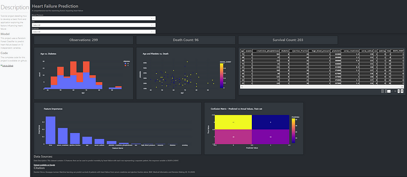

## Overview

This repository contains tutorial code for developing and deploying a dash application for predicting heart failure to Microsoft Azure. The goal is to provide an example of a well structured application, utilizing a wide variety of dash features, and being easily generalizable to other use cases.

## Data

The data used for this project is the Heart Failure prediction dataset available on kaggle here: https://www.kaggle.com/datasets/andrewmvd/heart-failure-clinical-data

## Components

1. model.py: Trains ensemble model to predict death event as a factor of input variables. Adds predicted column to heart failure dataset
2. app.py: Generates front end dash application to visualize data and handle use inputs, contains multiple components:

- Initial Data preprocessing
- Definition of individual app components; sidebar, main page, headers, etc.
- Definition of app structure incorporating individual components
- Callbacks for taking user input

## Final Product

The finished dashboard can be seen below, it includes a wide variety of dash components and can be easily modified for other datasets that require multiple graphs, text box's, and filters.

A walkthrough of the code can be found here: https://medium.com/p/e4696599377d

## Dashboard

